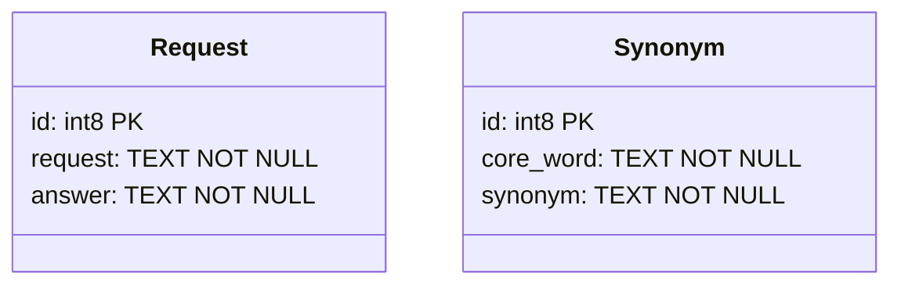
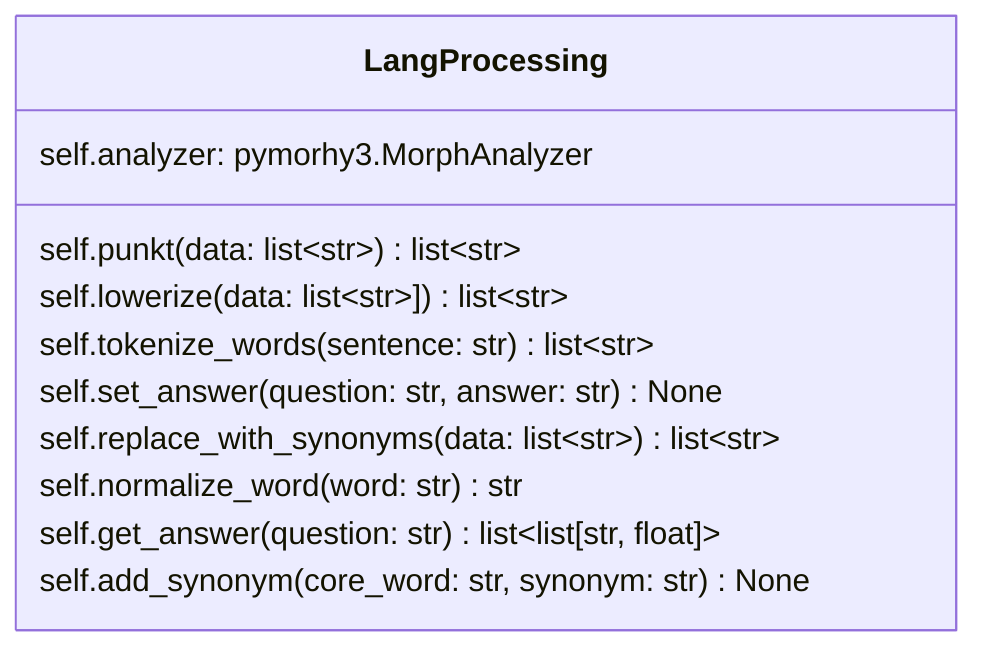
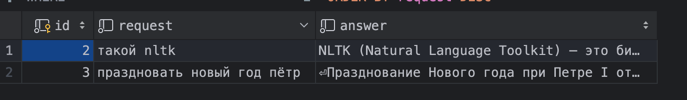
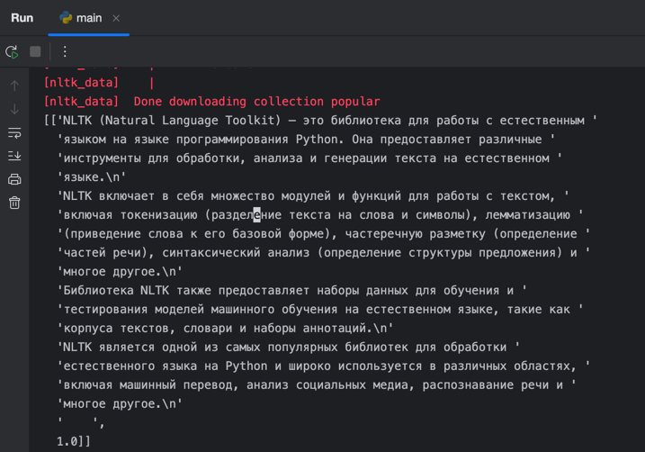
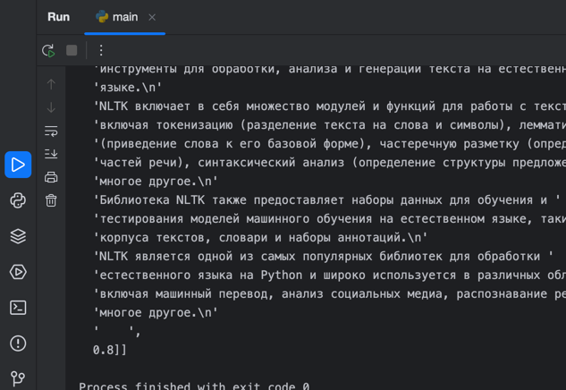
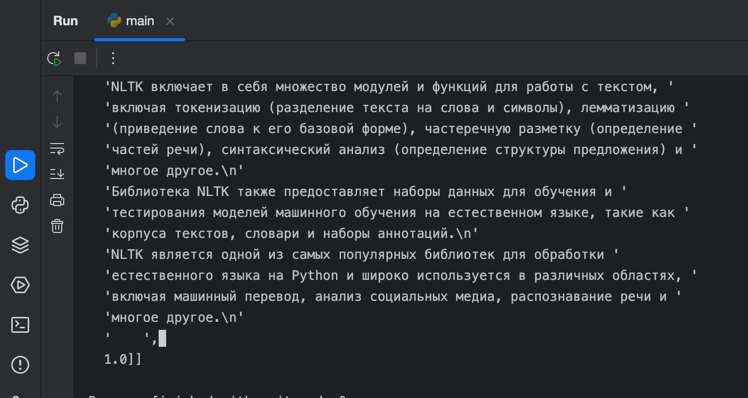

# Лабораторная работа №1

## Задача

Создать вопрос-ответную систему, на вход которой подается текст с вопросом, а на выходе ответ.

## Требования

Система должна уметь отвечать на вопросы, которые задаются разными синонимами:

**К примеру:**

Два вопроса:

1. Что такое NLTK
1. Чтоже такое NLTK?

Должны дать один и тот же ответ

## Архитектура

### База данных <a id="ERD"></a>



Присутствуют две таблицы SYNONYM и REQUEST.

Таблица REQUEST содержит вопросы и ответы

Таблица Synonym содержит синонимы на которые заменяются исходные слова

## Предварительные действия

Перед запуском нужно создать виртуальное окружение и установить зависимости указанные в requirements.txt

### Для UNIX

1. `python3 -m venv venv`
2. `source venv/bin/activate`
3. `pip install -r requirements.txt`

### Для Windows

1. `python -m venv venv`
2. `venv\Scripts\activate.bat`
3. `pip install -r requirements.txt`

## Реализация

### Взаимодействие с БД

Для взаимодействия с Базой Данных была использована библиотека ORM SQLAlchemy.

Ее интеграция выглядит следующим образом

```python
# database.py
from sqlalchemy.orm import sessionmaker, DeclarativeBase
from sqlalchemy import create_engine

engine = create_engine('sqlite:///database.db')
session_maker = sessionmaker(engine)


class Base(DeclarativeBase):
    pass

```

```python
# models.py

from sqlalchemy import Text
from .database import Base
from sqlalchemy.orm import Mapped, mapped_column


class Synonym(Base):
    __tablename__ = 'synonym'
    id: Mapped[int] = mapped_column(primary_key=True, autoincrement=True)
    core_word: Mapped[str] = mapped_column(Text, nullable=False)
    synonym: Mapped[str] = mapped_column(Text, nullable=False)


class Request(Base):
    __tablename__ = 'request'
    id: Mapped[int] = mapped_column(primary_key=True, autoincrement=True)
    request: Mapped[str] = mapped_column(Text, nullable=False)
    answer: Mapped[str] = mapped_column(Text, nullable=False)
```

В файле `database.py` мы создаем синхронный клиент управления БД через SQLAlchemy ORM (`sqlalchemy.engine`) и обертку на
создание сессии (`sqlalchemy.orm.sessionmaker`)

В файле `models.py` мы создаем модели которые копируют нашу [ERD](#ERD)


> Также была встроена система миграций `alembic`, но в ходе данной Лабораторной работы мы не будем ее рассматривать
>
> Гайд по ее настройке можно найти в официальной документации:
>
> https://alembic.sqlalchemy.org/en/latest/

### Основной скрипт программы

Основной скрипт программы лежит в файле `main.py`

Для начала мы импортировали все нужные библиотеки

```python
import difflib  # встроенная в python библиотека для поиска схожести итерируемых объектов

import nltk  # Natural Language ToolKit очень мощный инструмент для работы с естественными языками
import pymorphy3  # Библиотека для работы с морфологией

from nltk.corpus import stopwords  # поиск стоп-слов
from lab_1.models import Request, Synonym  # Модели из models.py
from lab_1.database import session_maker  # обертка на создание сессии
from sqlalchemy import insert, select, Result  # sqlalchemy query builders instances
```

Затем мы скачиваем данные nltk

```python
nltk.download('popular')
```

Далее мы создаем класс, в котором и будет вся логика приложения

```python
class LangProcessing:
```

Весь код класса можно представить следующей схемой



Пройдемся по каждому методу:

1.  ### punkt()
    Убирает пунктуационные знаки из слов и возвращает список слов без них.

    ```python
    def punkt(self, data: list[str]):
        """
        Filters out certain characters from a list of strings.

        Args:
            data (list[str]): A list of strings.

        Returns:
            list[str]: A new list of strings where certain characters have been filtered out.
        """
        return [x for x in data if x not in ",.- !? ;: () [] {} «»"]
    ```

2. ### lowerize()
   Применяет функцию `str.lower()` к каждому слову из списка
    ```python
        def lowerize(self, data: list[str]):
            """
            Converts a list of strings to lowercase.

            Args:
                data (list[str]): The list of strings to be converted to lowercase.

            Returns:
                list[str]: The list of strings with all elements converted to lowercase.
            """
            return [x.lower() for x in data]
    ```
3. ### tokenize_words()
   Токенизация слов с помощью встроенный в nltk метод tokenize
    ```python
        def tokenize_words(self, sentence):
            """
            Tokenizes a given sentence into individual words using the specified language tokenizer.

            Parameters:
                sentence (str): The sentence to be tokenized.

            Returns:
                list: A list of tokenized words.
            """
            return self.lowerize(
                self.punkt(
                    nltk.word_tokenize(sentence, language="russian")
                )
            )
    ```
   > **Токенизация** – процесс разбиения предложения на слова

4. ### set_answer()
   Метод установки ответа на вопрос (с добавлением его в БД)
    ```python
        def set_answer(self, question: str, answer: str):
            """
            Set the answer for a given question in the database.

            Args:
                question (str): The question to set the answer for.
                answer (str): The answer to set for the question.
            """
            question = ' '.join(
                [self.normalize_word(x) for x in self.tokenize_words(question) if x not in stopwords.words("russian")])

            with session_maker() as session:
                stmt = insert(Request).values(request=question, answer=answer)
                session.execute(stmt)
                session.commit()
    ```
1. ### replace_with_synonyms()
   Метод замены слов на синонимы
    ```python
        def replace_with_synonyms(self, data: list[str]) -> list[str]:
            """
            Replaces words in the given list with their synonyms.

            Args:
                data (list[str]): The list of words to replace.

            Returns:
                list[str]: The list of words with synonyms replaced.

            """
            stmt = select(Synonym).where(Synonym.core_word.in_(data))
            with session_maker() as sesssion:
                result: Result = sesssion.execute(stmt)
                synonyms = result.scalars().all()
                for synonym in synonyms:
                    data = [x.replace(synonym.core_word, synonym.synonym) for x in data]
            return data
    ```
1. ### get_answer()
   Получает ответ на вопрос с процентом схожести
   ```python
       def get_answer(self, question: str):
           """
           Retrieves the answer(s) to a given question.

           Args:
               question (str): The question to be answered.

           Returns:
               list: A list of answer(s) to the question, sorted by relevance.

           Raises:
               None
           """
           question = [self.normalize_word(x) for x in self.tokenize_words(question) if
                       x not in stopwords.words("russian")]
           question = self.replace_with_synonyms(question)

           with session_maker() as session:
               stmt = select(Request)
               result: Result = session.execute(stmt)
               data = result.scalars().all()

           returned = sorted([x for x in map(lambda x: [x.answer, difflib.SequenceMatcher(None, question,
                                                                                          x.request.split(' ')).ratio()],
                                             data) if x[1] > 0.75], key=lambda x: x[1], reverse=True)
           return returned

   ```
1. ### add_synonym()
    Нормализует и добавляет синонимы в БД
```python
    def add_synonym(self, core_word: str, synonym: str):
        core_word = [self.normalize_word(x) for x in self.tokenize_words(core_word) if
                     x not in stopwords.words("russian")]

        synonym = [self.normalize_word(x) for x in self.tokenize_words(synonym) if x not in stopwords.words("russian")]

        if len(core_word) == 0:
            core_word = ""
        else:
            core_word = core_word[0]
        if len(synonym) == 0:
            synonym = ""
        else:
            synonym = synonym[0]

        with session_maker() as session:
            stmt = insert(Synonym).values(core_word=core_word, synonym=synonym)
            session.execute(stmt)
            session.commit()
```


## Использование и тесты

1. Добавим ответ на вопрос, что такое NLTK?

   ```python
   if __name__ == '__main__':
       proc = LangProcessing()
       proc.set_answer('что такое NLTK', "<ОТВЕТ НА ВОПРОС>")
   ```

   2. В БД У нас добавилась следующая строка

      | id | request    | answer                                                                                                                                                                                                                       |
      |----|------------|------------------------------------------------------------------------------------------------------------------------------------------------------------------------------------------------------------------------------|
      | 2  | такой nltk | NLTK (Natural Language Toolkit) — это библиотека для работы с естественным языком на языке программирования Python. Она предоставляет различные инструменты для обработки, анализа и генерации текста на естественном языке. |
      

3. Проверим вывод ответа на вопрос
```python
# ...
   from pprint import pprint as pp
   pp(proc.get_answer("что такое nltk"))
```

Вывод будет следующий
```text
[['NLTK (Natural Language Toolkit) — это библиотека для работы с естественным '
  'языком на языке программирования Python. Она предоставляет различные '
  'инструменты для обработки, анализа и генерации текста на естественном '
  'языке.\n'
  'NLTK включает в себя множество модулей и функций для работы с текстом, '
  'включая токенизацию (разделение текста на слова и символы), лемматизацию '
  '(приведение слова к его базовой форме), частеречную разметку (определение '
  'частей речи), синтаксический анализ (определение структуры предложения) и '
  'многое другое.\n'
  'Библиотека NLTK также предоставляет наборы данных для обучения и '
  'тестирования моделей машинного обучения на естественном языке, такие как '
  'корпуса текстов, словари и наборы аннотаций.\n'
  'NLTK является одной из самых популярных библиотек для обработки '
  'естественного языка на Python и широко используется в различных областях, '
  'включая машинный перевод, анализ социальных медиа, распознавание речи и '
  'многое другое.\n'
  '    ',
  1.0]]
```


Тест показал единицу, что показывает 100% попадание на ответ

Чуть изменим запрос

```python

if __name__ == '__main__':
    from pprint import pprint as pp
    proc = LangProcessing()
    pp(proc.get_answer("что же такое nltk"))
```

Ответ по прежнему 100%, так как работает фильтр стоп слов

Изменим еще раз запрос
```python
if __name__ == '__main__':
    from pprint import pprint as pp
    proc = LangProcessing()
    pp(proc.get_answer("чтоже такое nltk"))
```
```text

[['NLTK (Natural Language Toolkit) — это библиотека для работы с естественным '
  'языком на языке программирования Python. Она предоставляет различные '
  'инструменты для обработки, анализа и генерации текста на естественном '
   ... ,
  0.8]]
```

А теперь ответ у нас 0.8 или 80%, так как у нас нет синонима к слову чтоже.

Давайте его добавим
```python
if __name__ == '__main__':
    from pprint import pprint as pp

    proc = LangProcessing()
    proc.add_synonym("чтоже", "что")
    pp(proc.get_answer("чтоже такое nltk"))

```

