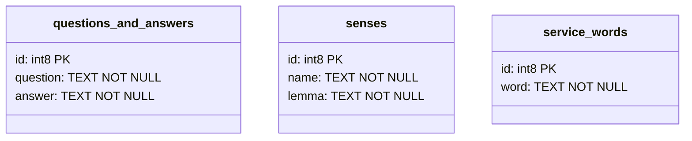
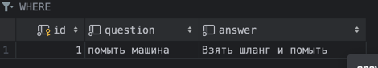
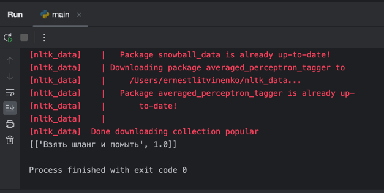

# Лабораторная работа №2-3

## Работа с лемамми

## Задача

Доработать код вопрос-ответной системы с учетом стоп слов и лем

## Требования

Система должна уметь отвечать на вопросы, которые задаются разными синонимами:

**К примеру:**

Два вопроса:

1. Что такое NLTK
1. Чтоже такое NLTK?

Должны дать один и тот же ответ

## Архитектура

### База данных <a id="ERD"></a>



## Предварительные действия

Перед запуском нужно создать виртуальное окружение и установить зависимости указанные в requirements.txt

### Для UNIX

1. `python3 -m venv venv`
2. `source venv/bin/activate`
3. `pip install -r requirements.txt`

### Для Windows

1. `python -m venv venv`
2. `venv\Scripts\activate.bat`
3. `pip install -r requirements.txt`

## Изменения

1. Был доработан метод stopwords для удаления стоп слов не только из внутренней базы nltk, но и БД

```python
    @property
def stopwords(self) -> list[str]:
    if self.__stopwords is None:
        with session_maker() as session:
            stmt = select(ServiceWord)
            result: Result = session.execute(stmt)
            data: list[ServiceWord] = result.scalars().all()
        self.__stopwords = stopwords.words("russian") + [x.word for x in data]
    return self.__stopwords
```

2. Добавлен метод add_stopwords для добавления стоп слов из xml файла в бд
3. Добавлен метод add_senses для добавления лемм из xml файла в бд
    ```python
    def add_senses(self, filepath: pathlib.Path):
        root = ET.parse(filepath).getroot()
        stmt = insert(Senses)
        with session_maker() as session:
            session.execute(stmt,
                            [{"name": child.attrib["name"].lower(), "lemma": child.attrib["lemma"].lower()} for child in
                             root])
            session.commit()
    ```
1. Переработан механизм добавления и поиска ответов на вопросы. теперь запрос делится на пары
```python
pairs = [' '.join([word_1, word_2]) for word_1, word_2 in zip(tokenized_words, tokenized_words[1:])]
question = ' '.join([self.normalize_word(x) for x in pairs])
```

```python
def normalize_word(self, word: str) -> str:
    if not isinstance(word, str):
        print(word)
        raise TypeError("Word must be a string")
    with session_maker() as session:
        stmt = select(Senses).where(Senses.name.like('%' + word + '%'))
        result: Result = session.execute(stmt)
        data: list[Senses] = result.scalars().all()
    if len(data) > 0:
        return data[0].lemma

    data: list[str] = [self.analyzer.parse(x)[0].normal_form for x in word.split(' ')]

    return ' '.join(data)
```

```python
def get_answer(self, question: str):
    tokenized_words = [word for word in self.tokenize_words(question) if word not in self.stopwords]
    pairs = [' '.join([word_1, word_2]) for word_1, word_2 in zip(tokenized_words, tokenized_words[1:])]

    question = [self.normalize_word(x) for x in pairs]

    question = [x for x in question if x != ""]

    with session_maker() as session:
        stmt = select(Request)
        result: Result = session.execute(stmt)
        data: list[Request] = result.scalars().all()

    ratio_dict = {}
    for qua in data:
        ratio_dict[qua] = max(difflib.SequenceMatcher(None, q, qua.request).ratio() for q in question)

    return list(sorted([[key.answer, val] for key, val in ratio_dict.items()], key=lambda x: x[1], reverse=True))
```

## Использование и тесты

1. Добавим ответ на вопрос: "Как помыть машину"
```python
if __name__ == '__main__':
    proc = LangProcessing()
    proc.set_answer("Как помыть машину?", "Взять шланг и помыть")
```


2. Проверим вывод информации
```python
print(proc.get_answer("Как правильно помыть машину и не испачкать руки?"))
```

